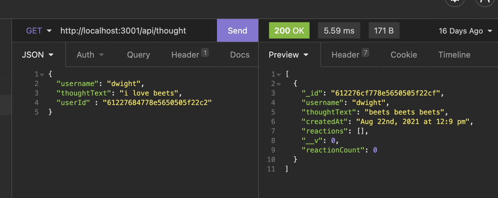

# Thoughts

## Description 
This backend application is a API for a social network  that can handle large amounts of unstructered data. It has been created utilizing NoSQL, Express.js, MongoDB database and Mongoose. 

## Table of Contents

* [Installation](#installation)
* [Usage](#usage)
* [Contributing](#contributing)
* [Tests](#tests)

## Installation
This application requries an npm install. 

## Usage 
Video: https://drive.google.com/file/d/1LjgOKP07h30J3Yvk29Xy7HZ2PUEXHcYp/view (Links to an external site.)

## Contributing
Please refer to this link:https://www.contributor-covenant.org/
    
## Tests
There are no test instructions at this moment. 

## Questions
Github: www.github.com/stephgeorge22
Email: stephanie.george22@gmail.com

